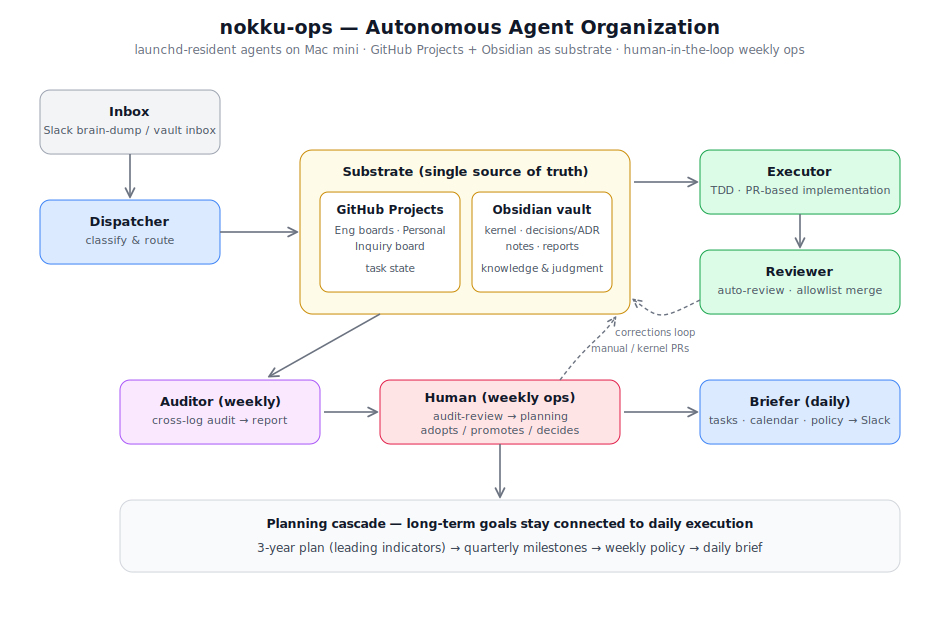

# nokku-ops — Architecture of an Autonomous AI Agent Organization

> 個人開発・生活・フリーランス業務のオペレーションを、**常駐AIエージェント組織**として設計・運用している実例の設計ドキュメントです。本体リポジトリは個人データを含むため private ですが、アーキテクチャと設計判断をここに公開しています。
>
> Runtime: TypeScript / Node.js on Mac mini (launchd) ・ Substrate: GitHub Projects + Obsidian vault ・ LLM: Claude (Agent SDK / Claude Code)



## エージェント構成（5役割・launchd 常駐）

| Agent | 役割 | 発火 |
|---|---|---|
| **Dispatcher** | inbox（Slack ブレインダンプ / vault inbox）の項目を分類し、タスク・思考ノート・Inquiry・エンジニアリング Issue に振り分ける | 定期 |
| **Executor** | board 上のコードタスクを拾い、TDD・PR ベースで実装。停止セマンティクス（故障カウンタと待機カウンタの分離）を実装 | 定期 |
| **Reviewer** | Executor の PR を自動レビュー。auto-merge は allowlist + shadow calibration（判定をログのみで検証してから権限を付与）で段階導入 | PR 契機 |
| **Auditor** | 1週間の全ログを横断監査し、パターン・要注意事項・改善提案を Weekly Audit Report として生成 | 週次 |
| **Briefer** | 当日のタスク・予定・週次方針を集約した Daily Brief を毎朝 Slack に配信 | 日次 |

## 設計上の主要判断（ADR 50件以上で管理）

- **情報境界の設計** — エージェントには生の認証情報や全データを渡さない。MCP サーバーを認可・スコープ制御のレイヤーとして挟み、事前にスコープ済みのデータだけが LLM に届く
- **Inline evaluation** — 評価を後付けのオフライン工程にせず、Auditor / Reviewer をループ内（inline）に置いて品質検査を運用の一部にする
- **人間の判断ポイントを明示的に設計** — 完全自動化を目指さない。週次の Audit Review・Planning は人間（私）が対話的に実施し、エージェントは材料の収集・提案までを担う（Augmentation not Transformation）
- **PR outcome → corrections loop** — マージ可否を暗黙の正解信号にせず、レビューコメントを構造化して Executor の改善入力に還流させる
- **substrate の一元化** — タスク状態の SoT は GitHub Projects、知識・判断記録の SoT は Obsidian vault（region 分割 + inbox routing）。ツール移行の判断もすべて ADR で記録

## 週次オペレーション（human-in-the-loop）

```
日曜朝:  Audit Report（自動生成）
   ↓
/audit-review  … レポートを対話レビュー。採用判定 → agent manual / kernel へ PR 昇格
   ↓
/planning      … 上位計画（3か年計画の先行指標）と突合して次週方針を決定
   ↓
weekly-policy  … Briefer が毎朝の Daily Brief に方針を降ろす
```

月次指標 → 週次方針 → 日次 Brief という降下パイプラインで、長期計画と日々の実行が接続されています。

## Numbers

- 5 agents / launchd 常駐（24時間）
- ADR 50+ / agent manuals / kernel documents による設計・判断の永続化
- TDD + PR 必須 + CI をエージェントにも適用（人間と同じ規約で動く）

## FAQ

**Q. なぜ本体を公開しないのか**
A. 生活オペレーション（健康・財務等の個人データ）が同居しているため。汎用化できる部品は [claude-code-templates](https://github.com/nokku-dev/claude-code-templates) として切り出しています。

**Q. 何のために作ったのか**
A. 認知コストの高い反復作業をシステムに吸収させ、人間は判断と創造に集中するため。同時に「AIエージェントを実運用で信頼可能にする設計とは何か」の実証実験でもあります。

---
*by [nokku](https://nokku.dev)*
